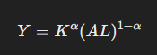
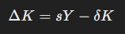
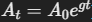
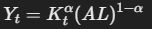
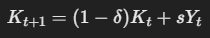
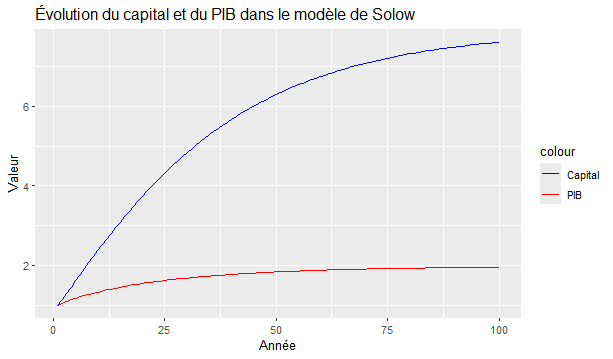

# Economic_Model_Solow1
Solow model (1956)

Ce projet est consiste à effecuer une modélisation du modèle de croissance économique néoclassique. 
Basé sur le modèle de Solow (1956), cette simulation permet l'explication de la dynamique de la production en fonction du capital, du travail et du progrès technologique.

Il y a plusieurs options :

- Trajectoire de la croissance économique en fonction du capital et du travail.
- Effet d’une variation du taux d’épargne sur le niveau de production.
- Impact du progrès technologique sur la croissance à long terme.
- Analyse de la convergence entre pays (les pays pauvres rattrapent-ils les riches ?

L’équation de base du modèle de Solow est la suivante :

Avec :

Y = Production (PIB)
K = Capital
L = Travail
A = Progrès technologique
Alpha = Elasticité du capital (généralement entre 0,3 et 0,4)

***L’élasticité du capital mesure dans quelle proportion la production varie lorsque la quantité de capital varie, toutes choses égales par ailleurs***

Plus **αlpha** est élevé, plus le capital a un impact important sur la production.

L’élasticité du capital est ***souvent estimée entre 0,3 et 0,4*** dans les modèles de croissance pour plusieurs raisons :

Données empiriques : Les études économiques (notamment celles de Solow et d'autres économistes) montrent que 30 à 40 % de la croissance économique provient du capital.

Rôle du travail : Le travail reste un facteur majeur de production, et l’élasticité du travail (1-α) est donc souvent autour de 0,6 à 0,7.

L'exposant alpha représente la part du capital dans la production, et 1−α représente la part du travail et du progrès technologique.

Pourquoi "1 - α" ?
Dans une économie, la production repose sur deux facteurs principaux :
1.	Le capital (K) : machines, infrastructures, etc.
2.	Le travail (L) : main-d'œuvre, ressources humaines.
Le paramètre alpha indique quelle part de la production provient du capital.

Puisque la somme des parts doit être égale à 1 (principe de rendements d’échelle constants), alors la part restante de la production provient du travail et du progrès technique.

Par exmple :
Si α=0.33, alors 33 % de la production est due au capital
La part restante, 67 % (soit 1−0.33 = 0.67) est due au travail et au progrès technologique.

L’évolution du capital suit :

Avec :
s = le taux d’épargne
δ (delta) = taux de dépréciation du capital

| Paramètre | Signification | Valeur dans le code R |
|-----------|-----------|-----------|
| Alpha   | Elasticité du capital (part du capital dans la produ°)  | 0.33  |
| S   | Taux d'épargne : proportion du PIB réinvestie en capital  | 0.2  |
| δ   | Taux de dépréciation : proportion du capital qui se détériore chq année  | 0.05  |
| A   | Progrès technologique initial  | 1  |
| L   | Population initiale  | 1 |
| Tmax   | Durée de la simulation (nombre d'années) | 100 |

α = 0.33 <=> 33 % de la production provient du capital et 67 % provient du travail
s = 0.2 <=> 20 % du PIB est réinvesti en capital chaque année
δ = 0.05 <=> 5 % du capital disparaît chaque année à cause de l’usure

Fonction qui représente la production économique totale (PIB) en utilisant une fonction de Cobb-Douglas :

K puissance alpha => La production dépend du capital élevé à la puissance alpha
(AL) puissance 1-alpha => La production dépend aussi du travail et du progrès technologique élevés à la puissance 1-alpha

Calcul du PIB (production) pour l'année t :

On utilise la fonction production (K[t], A, L, alpha)

Mise à jour du capital pour l'année suivante :

Explication économique :

- (1−δ)Kt : Le capital restant après dépréciation
- sYt : L’investissement (une fraction s du PIB est réinvestie en capital)

Cette modélisation permet donc la simulation de l’évolution du capital et du PIB sur 100 ans en appliquant la dynamique du modèle de Solow

Selon la théorie de Robert Solow :

À long terme, l’économie atteint un état stationnaire où le capital par tête et le PIB par tête cessent d’augmenter si la technologie et la population sont constantes.

Cette simualtion du modèle de 1956 permet donc de tester différentes hypothèses :
•	Que se passe-t-il si le taux d’épargne augmente ?
•	Que se passe-t-il si le progrès technologique évolue ?
•	Peut-on observer un effondrement économique si certains paramètres changent ?

En jouant avec s, δ, α et A, nous pouvons analyser différents scénarii économiques

Voici un schéma que nous pouvons obtenir après simulation :

